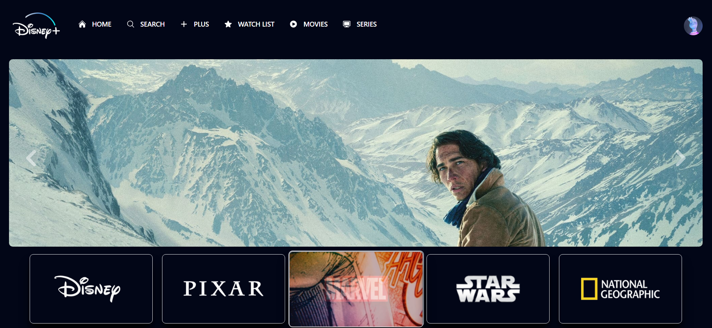
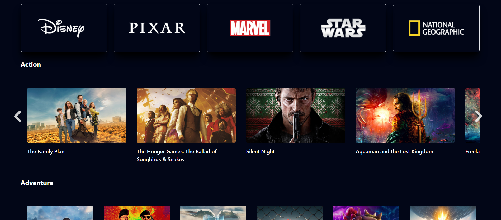

# Disney+ Clone
Esse projeto foi criado apenas com o intuito de estudo, prática e desenvenvolvimento com as tecnologias React Js e Tailwind, sintam-se a vontade para dar sujestões e dicas de como eu poderia ter feito melhor, afinal meu intuito é realmente aprender as melhores práticas de programação.

## Observações importantes
- Esse projeto utiliza a API do TMDB, sendo assim para executa-lo é necessário que você crie sua conta para obter uma chave de acesso à API;
- Uma vez criada sua conta e com sua chave em mãos baixe o projeto e crie um arquivo `.env` na raiz do projeto;
- Ness arquivo crie duas variáveis:
`VITE_REACT_APP_API_KEY = [sua chave]`

`VITE_REACT_APP_API_URL = "https://api.themoviedb.org/3`

## Iniciando o projeto
É necessário ter o NodeJs instalado para poder rodar o projeto no seu ambiente, sendo assim para instala-lo basta baixar a ultima versão do node na [página](https://nodejs.org/en) deles.

Para verificar se o node foi instalado e a versão basta digitar o comando no seu cmd:
`node - v`

Com o node instalado e seu arquivo `.env` criado, basta abrir o cmd do diretório do projeto e digitar o comando `npm run dev`.

## Screenshots

#

